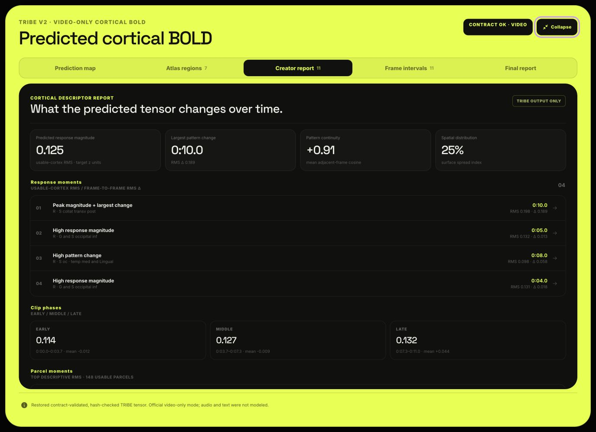
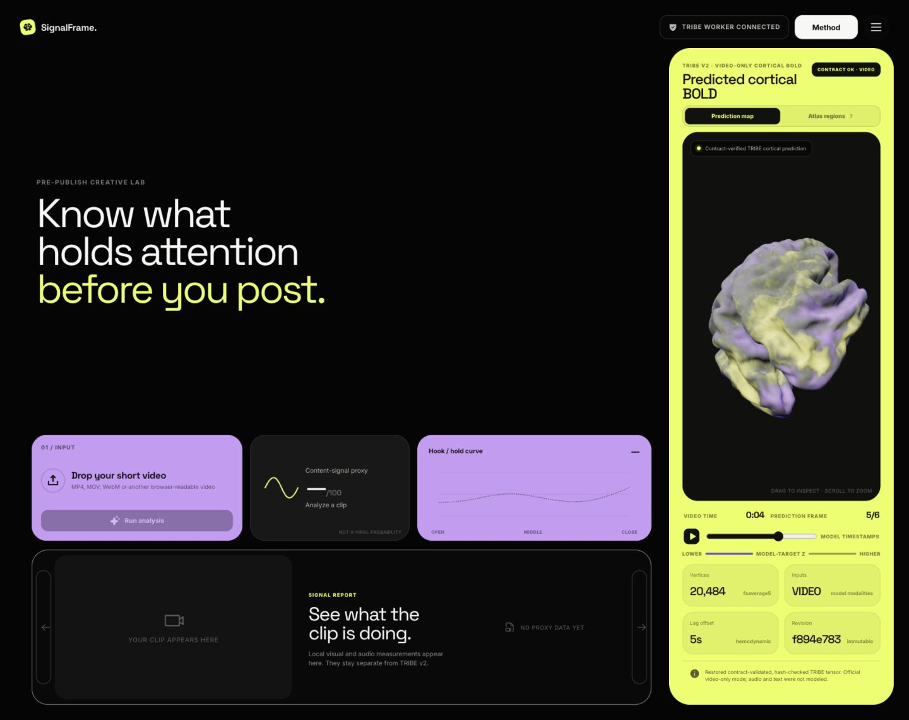

# SignalFrame

Evidence-first analysis for short-form video, with an independently verified
TRIBE v2 cortical-response viewer.

## About

SignalFrame is an open-source, pre-publish creative analysis lab for short-form
video. A creator can inspect measurable visual and audio structure, optional
learned model evidence, and a separately verified TRIBE v2 cortical-response
prediction before deciding what to test or edit.

The project deliberately keeps three evidence lanes separate:

- **Content signals** describe properties measured from the uploaded clip.
- **Multimodal evidence** describes what pinned visual, semantic, and audio
  encoders extract when those optional workers are configured.
- **TRIBE v2 descriptors** summarize a verified predicted cortical BOLD tensor;
  they never become an engagement or virality score.

SignalFrame is designed to fail closed: a model name, a confident-looking
number, or a brain animation is never accepted as a substitute for validated
evidence. Its purpose is to help creators form clearer editing experiments—not
to promise views, retention, or platform distribution.

> [!IMPORTANT]
> SignalFrame does not claim that TRIBE v2 predicts virality. TRIBE v2 predicts
> average-subject cortical BOLD responses to audiovisual stimuli. Behavioral
> probabilities remain unavailable unless a separately trained,
> target-specific calibration head passes the project's provenance and
> evaluation gates.

## Product preview

### Creator report



*An expanded tensor-derived Creator Report. These values describe the verified
TRIBE prediction and are not measured audience behavior.*

### 3D cortical replay



*A saved video-only TRIBE v2 result replayed on the 20,484-vertex fsaverage5
cortical surface in a WebGL-capable browser. The colors encode predicted
model-target BOLD values—not attention, engagement, emotion, or virality.*

## What works today

| Capability | Current implementation | Honest interpretation |
| --- | --- | --- |
| Local clip analysis | Browser-decoded opening, pacing, continuity, ending, visual, and audio measurements | Directional content-signal indices; not observed audience behavior |
| Durable Forecast Lab jobs | Private `10–60 s` uploads, authoritative `ffprobe` validation, resumable job IDs, bounded workers, atomic results | An evidence pipeline; it does not create missing behavioral labels |
| Visual-temporal evidence | Pinned V-JEPA 2.1 Base worker | Learned visual representation; not attention or retention |
| Keyframe semantics | Pinned NanoLLaVA MLX fallback over six source frames | Still-frame descriptions; not VideoLLaMA and not continuous-video understanding |
| Audio evidence | Pinned AST AudioSet labels plus measured PCM/STFT descriptors | Sound-label and signal evidence; not a transcript or audience model |
| 3D cortical map | Genuine TRIBE v2 `T x 20,484` `fsaverage5` tensor only | Predicted average-subject BOLD; never colored by local content scores |
| Creator report | Tensor-derived time, continuity, magnitude, change, and Destrieux parcel summaries | Descriptive neural-model output; not emotion, memory, or engagement |
| Behavioral forecast heads | Fail-closed production-calibration registry | Values stay withheld until an approved head is installed |

The UI also contains a local **Modeled Engagement** index and a transparent
**Virality Outlook** assembled from measured content features. These are
directional product heuristics, not calibrated probabilities, expected views,
or platform guarantees. They are visually and computationally separate from
TRIBE.

## Design principles

- **Separate evidence from outcomes.** Encoders describe a clip; they do not
  become audience predictors without outcome data and calibration.
- **Keep the brain honest.** The cortical mesh is neutral unless the backend
  returns a hash-verified TRIBE v2 tensor with exactly 20,484 vertices per
  frame.
- **Preserve provenance.** Model revisions, weight hashes, preprocessing
  contracts, input hashes, tensor shape, timing, and result hashes travel with
  every verified artifact.
- **Expose unavailable states.** A missing model, codec, WebGL context, account
  history, trend snapshot, or calibration head is shown as unavailable—not
  guessed.
- **Treat creator media as sensitive.** Job responses are private/no-store,
  uploads are bounded and discarded after a job, and persisted derived
  artifacts have explicit retention implications.

## Architecture

SignalFrame uses late fusion rather than a monolithic “viral classifier”:

```text
short video
  |-- browser measurements ---------------- descriptive local indices
  |-- V-JEPA 2.1 --------------------------- visual-temporal evidence
  |-- NanoLLaVA ---------------------------- sampled-keyframe semantics
  |-- AST + measured audio ----------------- sound/signal evidence
  `-- creator-declared context ------------- factual publishing context
                 |
                 `-- approved calibrated heads (none bundled)

short video
  `-- pinned V-JEPA2 -> TRIBE v2 ----------- cortical BOLD tensor/report
                                                    forecast contribution: false
```

See [Architecture](docs/ARCHITECTURE.md) for components, data flow, storage,
and trust boundaries.

## Quick start on macOS

### Requirements

- macOS on Apple silicon is recommended for the local MLX and MPS paths.
- Node.js 20 or newer and npm.
- Python 3.11.
- `ffmpeg`, `ffprobe`, and Git.
- A current hardware-accelerated Chrome, Safari, or Firefox for the 3D viewer.
- Several gigabytes of free disk space when optional model artifacts are used.

Install the system tools with Homebrew:

```bash
xcode-select --install
brew install node python@3.11 ffmpeg git git-lfs
```

### 1. Install the frontend

```bash
npm ci
```

### 2. Install the backend

Keeping the Python runtime outside an iCloud/File Provider checkout avoids
macOS `dataless` placeholder stalls:

```bash
export SIGNALFRAME_RUNTIME="$HOME/Library/Application Support/SignalFrame"
mkdir -p "$SIGNALFRAME_RUNTIME"

python3.11 -m venv "$SIGNALFRAME_RUNTIME/py311"
export SIGNALFRAME_BACKEND_PYTHON="$SIGNALFRAME_RUNTIME/py311/bin/python"

"$SIGNALFRAME_BACKEND_PYTHON" -m pip install --upgrade pip wheel
"$SIGNALFRAME_BACKEND_PYTHON" -m pip install \
  'torch==2.6.0' 'torchvision==0.21.0'
"$SIGNALFRAME_BACKEND_PYTHON" -m pip install -r backend/requirements.txt
"$SIGNALFRAME_BACKEND_PYTHON" -m pip install \
  'timm==1.0.19' 'einops==0.8.2' 'transformers==4.57.6'
```

Copy the environment template; the destination is ignored by Git:

```bash
cp backend/.env.macos.example backend/.env.local
```

For the supported local research ablation, set these values in
`backend/.env.local`:

```dotenv
SIGNALFRAME_BACKEND_PYTHON="$HOME/Library/Application Support/SignalFrame/py311/bin/python"

TRIBE_DEVICE=mps
TRIBE_INFERENCE_MODE=vision-only
TRIBE_VIDEO_DEVICE=mps
TRIBE_VIDEO_PRECISION=autocast-fp16
TRIBE_PRELOAD_MODEL=false

TRIBE_CORS_ORIGINS=http://localhost:4173,http://127.0.0.1:4173
TRIBE_CORS_ALLOW_CREDENTIALS=false
```

Set `HF_TOKEN` in your ignored local file, or authenticate with `hf auth
login`. Never commit a token. The full TRIBE
video/audio/text path requires gated model access and is intended for a
Linux/NVIDIA deployment; the macOS mode above is explicitly video-only.

### 3. Run the app

Terminal 1:

```bash
./backend/run-local-mac.sh
```

Terminal 2:

```bash
npm run dev -- --host 127.0.0.1 --port 4173
```

Open [http://127.0.0.1:4173](http://127.0.0.1:4173). Confirm backend state
before running inference:

```bash
curl --fail http://127.0.0.1:8000/api/tribe/v1/status
curl --fail http://127.0.0.1:8000/api/forecast/v1/status
```

This base setup runs the interface, measured evidence, job service, and the
TRIBE worker when its pinned artifacts are available. V-JEPA 2.1, AST, and
NanoLLaVA are optional local branches with their own immutable artifacts. The
complete clean-machine instructions and verified hashes are in
[macOS setup](docs/MACOS_SETUP.md).

## API overview

| Method | Route | Purpose |
| --- | --- | --- |
| `GET` | `/api/tribe/v1/status` | Live TRIBE worker state and provenance |
| `POST` | `/api/tribe/v1/predict` | Run validated cortical inference for one video |
| `GET` | `/api/tribe/v1/results/{id}/manifest.json` | Retrieve a result manifest |
| `GET` | `/api/forecast/v1/status` | Score-free capability and provider contract |
| `POST` | `/api/forecast/v1/jobs` | Submit a private 10–60 second evidence job |
| `GET` | `/api/forecast/v1/jobs/{id}` | Poll durable job state and real stages |
| `GET` | `/api/forecast/v1/results/{id}` | Retrieve an atomically published evidence result |

Detailed request, binary tensor, caching, and registry contracts are in
[backend/README.md](backend/README.md) and
[backend/forecast/README.md](backend/forecast/README.md).

## Test and build

```bash
# Build first because the packaging contract verifies generated dist files
npm run build

# Frontend, analysis, UI, and packaging contract tests
npm test
npm run test:sites

# Backend tests (activate your Python 3.11 environment first)
python -m unittest discover -s backend/tests -v
```

The test suite covers analysis determinism, neural/data separation, binary
tensor validation, cortical mesh/atlas assets, thumbnails, frame intervals,
A/B comparison behavior, capability contracts, provider provenance, durable
jobs, model workers, result caching, and fail-closed calibrated heads.

## Documentation

- [macOS setup](docs/MACOS_SETUP.md) — clean installation, optional models,
  running, verification, and troubleshooting
- [Architecture](docs/ARCHITECTURE.md) — components, boundaries, data flow, and
  persistence
- [Scientific limits](docs/SCIENTIFIC_LIMITS.md) — what every output can and
  cannot support
- [Publish to GitHub](docs/PUBLISH_TO_GITHUB.md) — secret-safe first push under
  your own Git identity
- [Forecast architecture](FORECAST_ARCHITECTURE.md) — calibration requirements
  and activation order
- [Local verification report](verification-report.md) — saved TRIBE tensor
  provenance and validation evidence

## Privacy and security

- `.env.local`, Python environments, Node dependencies, model caches, uploaded
  media, runtime jobs, result tensors, and thumbnails are excluded from source
  control.
- Forecast uploads are streamed with a size limit, probed without a shell, and
  deleted after completion or failure. Completed forecast JSON remains under
  the configured private job directory until an operator removes it.
- TRIBE result tensors and source-derived thumbnails are persisted for replay
  and exact-repeat caching. Treat both as sensitive and define a retention
  policy before multi-user deployment.
- The local server has no authentication layer. Bind it to `127.0.0.1` for
  personal use; add authentication, authorization, TLS, isolation, and data
  lifecycle controls before exposing it to a network.

## Third-party models and licenses

This repository does not bundle model weights. Each downloaded model remains
subject to its own terms:

- [TRIBE v2](https://github.com/facebookresearch/tribev2) code and weights:
  **CC BY-NC 4.0**. The TRIBE path is research/non-commercial unless you obtain
  separate permission.
- [V-JEPA 2 / 2.1](https://github.com/facebookresearch/vjepa2): use the license
  attached to the exact upstream code and checkpoint you download.
- [MIT AST AudioSet](https://huggingface.co/MIT/ast-finetuned-audioset-10-10-0.4593):
  model-card license **BSD-3-Clause**.
- [NanoLLaVA MLX 8-bit](https://huggingface.co/mlx-community/nanoLLaVA-1.5-8bit):
  model-card license **Apache-2.0**.

Third-party attribution is not an endorsement. Review every upstream model
card, dataset term, and license before redistribution or commercial use. See
[Scientific limits](docs/SCIENTIFIC_LIMITS.md) for the research and product
boundaries.

The bundled cortical mesh and atlas files are modified scientific-data
derivatives, not MIT-licensed original assets. Before a public release, verify
that their redistribution and notice requirements are satisfied for the exact
files being shipped; preserve the complete terms identified in
[NOTICE](NOTICE.md).

## Author and license

SignalFrame's sole project author is **Karan Chandra Dey**.

Original SignalFrame source code is released under the [MIT License](LICENSE),
Copyright © 2026 Karan Chandra Dey. Third-party libraries, model code, model
weights, data, and assets remain under their respective licenses and are not
relicensed by the SignalFrame MIT License. Required attributions and license
boundaries are collected in [NOTICE](NOTICE.md).
