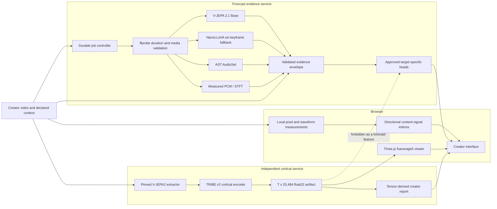

# Architecture

SignalFrame is an evidence pipeline with two independent analysis tracks:

1. creator-facing content evidence and optional calibrated behavioral heads;
2. TRIBE v2 cortical-response inference and visualization.

The separation is a product invariant, not only a UI choice. TRIBE tensors and
brain-derived descriptors are forbidden forecast features.

## System map



`Approved target-specific heads` is an extension point. The production
approval table is intentionally empty in this release, so behavioral values
remain unavailable even when all descriptive providers run successfully.

## Frontend

The React/Vite frontend owns:

- video selection and browser duration preflight;
- local visual and Web Audio measurements;
- the directional Modeled Engagement and Virality Outlook presentation;
- creator-declared platform, caption, topic, genre, locale, schedule, and
  account-summary fields;
- forecast job submission, durable polling, retry/resume, and result display;
- TRIBE manifest/binary validation, timeline playback, parcel selection,
  thumbnails, frame intervals, plain-language report, and A/B cut comparison;
- the original Three.js `fsaverage5` cortical viewer.

Browser duration is only a convenience check. The server's `ffprobe` result is
authoritative for Forecast Lab admission.

The brain component accepts only a validated TRIBE manifest and float32 tensor.
WebGL failure produces an explicit unavailable state. It does not switch to a
decorative brain or color the mesh with browser scores.

## Forecast evidence service

The forecast API is under `/api/forecast/v1`.

### Job lifecycle

```text
queued -> probing -> running -> complete
                            \-> failed
```

- Uploads are streamed to disk with an enforced byte limit and SHA-256.
- `ffprobe` runs without a shell and requires a decodable video stream whose
  duration is 10 through 60 seconds inclusive.
- A client-generated UUID `Idempotency-Key` becomes the durable job ID. A retry
  with the same key cannot enqueue duplicate inference.
- Worker stages and wall-clock elapsed time are real. There is no fabricated
  percentage-complete mapping.
- Runner output must match the strict evidence/head/boundary schema and remain
  below the configured result limit.
- Results are staged, fsynced, and atomically renamed before a job becomes
  complete.
- A process restart marks interrupted work failed instead of claiming a partial
  result is complete.

### Evidence branches

| Branch | Input | Output | Explicitly not |
| --- | --- | --- | --- |
| V-JEPA 2.1 Base | Deterministic 64-frame, 4 fps windows | 768-D pooled representation and temporal descriptors | Attention, retention, virality |
| NanoLLaVA | Six deterministic 384 px source frames | Schema-validated literal scene/action/shot observations | VideoLLaMA, OCR, audio, continuous motion |
| AST | Deterministic 16 kHz mono audio windows | Top AudioSet labels and independent sigmoid scores | Transcript, music quality, audience response |
| Measured audio | Decoded bounded PCM | RMS, silence fraction, centroid, flatness, flux, energy peaks | A learned model or semantic inference |
| Creator context | Strict creator-supplied JSON | Factual eligibility and publishing context | A model output or verified account history |

Every learned adapter verifies its exact local artifact before loading. A
missing optional dependency or invalid result disables only that branch. An
adapter always declares `behavioralOutcome: false`.

### Behavioral head gate

A numeric behavioral value is accepted only when all of these agree:

- a code-owned target definition and release approval;
- immutable model and calibrator artifacts;
- the exact feature-to-evidence contract;
- platform, domain, locale, population, duration, denominator, and horizon;
- creator-disjoint, chronological held-out evaluation evidence;
- current calibration/evaluation expiry and quality thresholds; and
- a finite output in the head's declared range.

A registry document proves artifact identity but cannot approve itself. A
self-declared JSON head therefore cannot unlock a score. Unsupported or
unapproved metrics stay `null` with an explicit reason.

## TRIBE cortical service

The TRIBE API is under `/api/tribe/v1` and is operationally independent of the
forecast service.

The backend:

1. streams and hashes the video;
2. validates model/code/checkpoint/preprocessing identity;
3. runs the configured official extractor and released cortical encoder;
4. validates the returned time-major shape as `T x 20,484`;
5. writes little-endian float32 frames plus a provenance manifest;
6. creates source-derived thumbnails at authoritative interval starts; and
7. publishes a content-addressed cache entry only after read-back validation.

The vertex order is fixed:

- left hemisphere: indices `0–10,241`;
- right hemisphere: indices `10,242–20,483`.

All frames within one result use one robust global display scale. Raw values
are not changed by display mapping, and colors are never normalized per frame.
The viewer can therefore show temporal change without manufacturing contrast
at each second.

The macOS profile is a labeled vision-only ablation. The published full path
also consumes audio and text and is intended for a CUDA host. The inference
mode and missing modalities are always present in result provenance.

## Creator report and frame intervals

The report reduces the raw cortical tensor, not rendered RGB colors. It can
describe:

- predicted response magnitude by model interval;
- adjacent cortical-pattern change;
- early/middle/late duration-weighted summaries;
- continuity, persistence, and spatial distribution; and
- strongest validated Destrieux parcel per interval.

Frame rows preserve authoritative model times and show a source-video
thumbnail captured at or after that time. A missing real frame is reported as
missing; it is not synthesized.

These interval rankings are **not attention spans**. They are rankings of
TRIBE-predicted BOLD magnitude or pattern change under an average-subject
model. See [Scientific limits](SCIENTIFIC_LIMITS.md).

## A/B cut comparison

The A/B Lab aligns two independently validated TRIBE timelines and compares
their descriptive cortical-pattern summaries. “Seek moment” moves the relevant
media/timeline selection to an authoritative interval. It is an editing aid,
not a randomized platform experiment and not evidence that one version will
perform better.

## Persistence and data lifecycle

| Data | Default location | Lifecycle |
| --- | --- | --- |
| Forecast job state/results | `backend/.runtime/forecast` | Source upload deleted after job; JSON persists until operator retention cleanup |
| TRIBE work files | `backend/.runtime/work` | Raw temporary content removed after inference |
| TRIBE result tensors/manifests/thumbnails | `backend/.runtime/results` | Persist for replay/cache until operator cleanup |
| Neural/extractor caches | `backend/.runtime/cache` | Persist to accelerate exact compatible work |
| Hugging Face cache | configured Hub cache | Persist under operator control |

All runtime paths, environments, credentials, model artifacts, and results are
excluded from Git. Public deployment still needs authentication,
authorization, per-user isolation, quotas, TLS, malware/media hardening, audit
logging, and a documented deletion policy.

## Runtime boundaries

- The FastAPI service is designed for one local operator and serializes heavy
  inference. Multi-user scale needs a real queue, isolated workers, and
  accelerator-aware admission control.
- The NanoLLaVA MLX runtime stays in a separate environment and communicates by
  bounded strict JSON over standard input/output.
- Readiness endpoints do not load large models merely to render the UI.
- Exact-repeat caches include input bytes and every relevant model, code,
  preprocessing, device, and precision pin. A changed pin yields a different
  identity.
- The server returns `private, no-store`, `no-cache`, and `nosniff` headers for
  forecast job/result documents.

## Extension rules

When adding another provider:

1. name the evidence it actually produces;
2. pin immutable source, weights, license, and preprocessing;
3. validate input and output schemas and finite numeric bounds;
4. keep `behavioralOutcome: false` unless it is an approved outcome head;
5. expose unavailable and out-of-domain states;
6. test failure, timeout, restart, and corrupted-artifact behavior; and
7. never route TRIBE/cortical features into a performance score.

The deeper wire and registry contracts are documented in
[backend/forecast/README.md](../backend/forecast/README.md).
